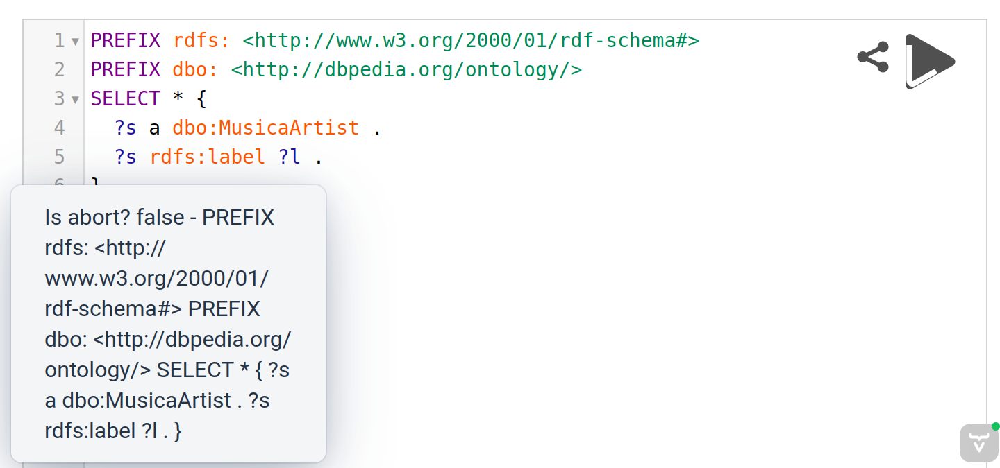

# vaadin-yasqe
Vaadin bindings for Yasqe



## Features

* Execute Button (aka Query Button), Short Link and Curl Buttons configurable.
* HTTP Request Parameters configurable (RequestConfig)
* Prefix API URL configurable

## Limitations

* Prefix lookups should actually go to Vaadin first, rather than directly to a third party remote API - this is future work.

## Maven

```
<dependency>
    <groupId>org.aksw.vaadin.yasqe</groupId>
    <artifactId>vaadin-yasqe-flow</artifactId>
</dependency>
```

Click [here](https://central.sonatype.com/artifact/org.aksw.vaadin.yasqe/vaadin-yasqe-flow) to see all published versions.

## Versions

| vaadin-yasqe-flow | based on             |
|:-----------------:|:--------------------:|
|             0.5.0 | @zazuko/yasqe:4.2.34 |


## Usage
See the demo for details.

```java
public class MyComponent extends VerticalLayout {
    public MyComponent() {
        setSizeFull();
        YasqeConfig config = new YasqeConfig();
        config.setResizeable(false);
        Yasqe yasqe = new Yasqe(config);
        yasqe.setSizeFull();
        this.add(yasqe);

        yasqe.addQueryButtonListener(ev -> {
            new Notification("Is abort? " + ev.isAbort() + " - " + ev.getValue(), 5000)
                .open();
            ev.getSource().updateQueryButton(!ev.isAbort(), null);
        });
    }
}
```

## Run the demo

* Clone this repository
* Run `mvn install && mvn -f vaadin-yasqe-demo spring-boot:run`
* Open <a href="http://localhost:8080" target="_blank">http://localhost:8080</a>


## Credits

* This vaadin-plugin project layout is based on that of [vaadin-maps-leaflet-flow](https://github.com/xdev-software/vaadin-maps-leaflet-flow).
